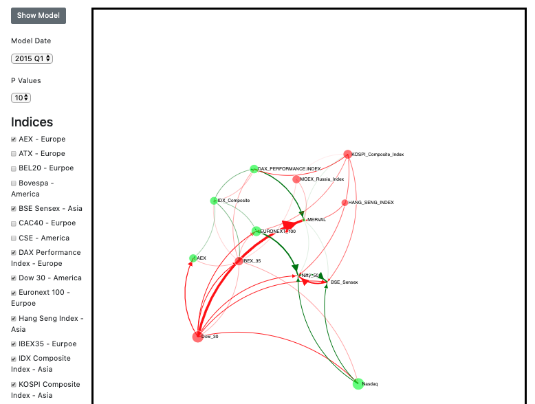

# DEPENDENCY AMONG ECONOMIES, MEASURED BY MAIN STOCK INDICES 

## DESCRIPTION - Describe the package

Our Projects goal was to Analyze economic dependency among economies by measuring the strength, direction,and relationship between their main stock indices, and how these relationships have changed over timethrough a practical visualization

## Folder structure
* data/ = all data files csv and json files generated 
* dataprep.ipyb = jupyter notebook 
* src/ = python upload stuff for gathering data
    * stocks.py = has all stocks and symbols used
    * upload.py = upload script to get data from yahoo and save csv files
    * csv_json.py = create json from csv files
    * change_in_close_price.py = csv with change percent per day 
* lib/ = D3 stuff
* index.html = html code
* index.js = js code for d3 vizualizationns
* r_code/ = r_code to generate data in r_data/
* r_data/ = csv files generated for model visualization
* venv = virtual environment
* requirements = pip installs required to get index.py to run

## INSTALLATION - How to install and setup your code
* git clone repo
```
git clone https://github.gatech.edu/apayne44/Data_and_Visual_Analytics_Project.git

```
* create python virtual environment
```
    python3 -m venv /path/to/new/virtual/environment
```
* install python requirements
    * only needed to create new data
    * alot of requiremnets are for jyupter which is only needed if you wish to use notebook
```
    source venv/activate/bin
    pip install -r requirements.txt
```
* install packages in R
    * all packages used found in anaconda r essential bundal
        * vars 
        * lubridate
    * install anaconda
    * install r essential bundal 
```
   # download R essential bundal
   conda install -c r r-essentials
```

## EXECUTION - How to run a demo on your code

### DEMO VIDEO
[](https://youtu.be/_WM7tLt-Btk)

### To view model visualization
```
    # be at root directory and run
    python3 -m http.server
```
* go to http://localhost:8000/

### To get new up todate data
* to change the dates of data grabedgo to ./src/stocks.py
* change end to end date you wish to examine
* change start to start date you wish to examine
* see varible all_stocks_info also at ./src/sctocks.py  and add stock name & create foleder of stock name in ./data and use stock name found for stock in yahoo for symbol
```
    source venv/bin/activate
    pip install -r requirements.txt
    cd src
    python3 upload.py
```
* what upload.py goes 
    * goes to yahoo finance gets cookie needed to download cvs
    * then cycles through stocks to be downloaded and adds them to ../data/{index name}/data.csv
    * script references: https://www.mapleprimes.com/posts/208409-Downloading-Historical-Stock-Quotes

* to format data or pull all data from csv files into single json file = ./data/stock_data.json
```
    source venv/bin/activate
    cd src
    python3 csv_json.py
```
* create change stock percent from generated  =  ./data/change_precent.json
```
    source venv/bin/activate
    cd src
    python3 change_in_close_price.py
```
### build model with new data
```
    cd r_code
    chmod +x project_v6.R
    Rscript project_v6.R
```

## starting jupyter notebook to view uploaded csv or json data
```
    git clone repo
    python3 env ./venv
    source venv/bin/activate
    pip install -r requirements.txt
    jupyter notebook dataprep.ipynb
```

## stocks to be used:
* AEX = (^AEX)
* ATX = (^ATX)
* BEL 20 = (^BFX)
* Bovespa = (^BVSP)
* BSE Sensex = (^BSESN)
* CAC40 = (^FCHI)
* CSE = (^GSPTSE)
* DAX PERFORMANCE-INDEX =  (^GDAXI)
* Dow 30 = (^DJI)
* EURONEXT 100 = (^N100)
* HANG SENG INDEX = (^HSI)
* IBEX 35 = (^IBEX)
* IDX Composite = (^JKSE)
* KOSPI Composite Index = (^KS11)
* MOEX Russia Index = (IMOEX.ME)
* Nasdaq = (^IXIC)
* Nifty 50 = (^NSEI)
* IPC MEXICO = (^MXX)
* MERVAL = (^MERV)
* Nikkei 225 = (^N225)
* Russell 2000 = (^RUT)
* S&P 500 = (^GSPC)
* S&P/NZX 50 INDEX GROSS = (^NZ50)
* S&P/TSX Composite index = (^GSPTSE)
* SMI = (^SSMI)
